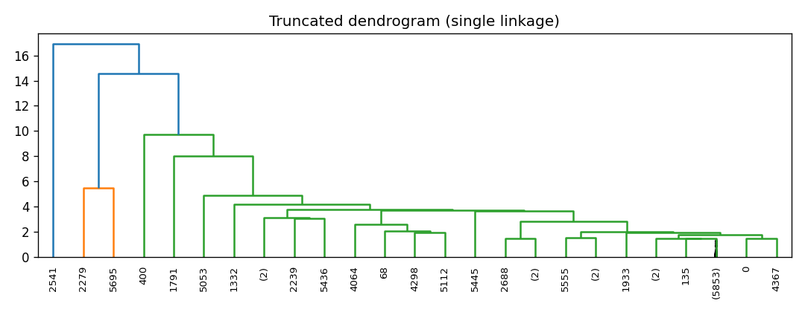
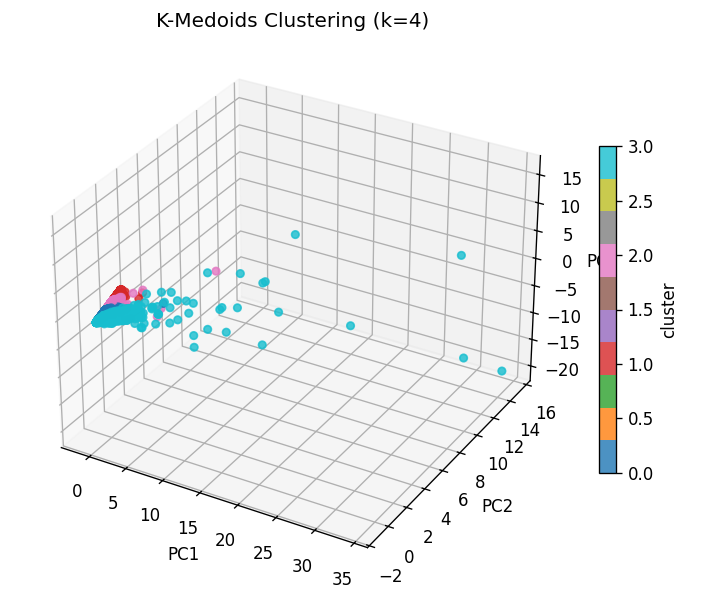

# Retail Customer Clustering Analysis


---

## Project Overview

The goal of this project is to apply clustering techniques to real-world customer transaction data to derive meaningful customer segments. This enables businesses to better understand customer behavior, target high-value segments, and personalize marketing efforts.

We use the **Online Retail II** dataset from the UCI repository. The dataset contains over 1 million retail transactions, including customer IDs, product descriptions, invoice dates, quantities, and prices.

**Our analysis includes:**
- RFM feature engineering (Recency, Frequency, Monetary)
- Agglomerative Hierarchical Clustering
- K-Medoids Clustering
- FP-Growth for association rule mining
- Result visualizations and performance comparison

---

## Dataset Summary

- **Records processed**: 1,067,371  
- **Unique customers**: 5,881  
- **RFM features**: Recency (days since last purchase), Frequency (purchase count), Monetary (total amount spent)  
- **Clustering features**: Scaled RFM data  

---

## Algorithms Used

### 1. Agglomerative Hierarchical Clustering
- Linkage method: `single`
- Distance metric: `euclidean`
- Performed using `scipy.cluster.hierarchy.linkage` and `fcluster`

### 2. K-Medoids Clustering
- Distance metric: `manhattan`
- Implemented from scratch using distance matrix and medoid updating

### 3. FP-Growth
- Used to mine frequent itemsets and generate association rules
- Implemented using `mlxtend.frequent_patterns`

---

## Visualizations & Results

### Dendrogram - Hierarchical Clustering



- A truncated dendrogram shows cluster branching structure.
- `k = 4` was chosen based on visual gap.

---

### PCA Visualizations (3D)

**Hierarchical Clustering (k=4):**


**K-Medoids Clustering (k=4):**



- PCA reduces the 3-dimensional RFM data for 3D cluster visualization.
- Hierarchical clustering shows more compact clusters.

---

### Silhouette Score Comparison


| Method         | Silhouette Score |
|----------------|------------------|
| Hierarchical   | **0.94**         |
| K-Medoids      | **0.28**         |

- Hierarchical clustering exhibits better-defined boundaries.

---

### Attribute Importance per Cluster


- This heatmap shows how each RFM attribute contributes to each cluster.
- Positive or negative deviation from the population mean is color-encoded.

**Insights:**
- Cluster 0 = Recent buyers
- Cluster 2 = High spenders
- Cluster 3 = Low recency, low monetary

---

### FP-Growth Association Rules

- **Frequent itemsets mined**: 163  
- **Rules extracted**: 45  
- **Support threshold**: ≥ 2%

Examples:
- `Paper` ⇒ `Envelopes`
- `Candle` ⇒ `Holder`

These help in marketing bundles or store layout planning.

---

## Conclusion

- **Hierarchical clustering** (single linkage, Euclidean) is more suitable for this dataset than K-Medoids.
- **Silhouette analysis and PCA** confirm that clusters are well separated.
- **FP-Growth** provides product insights for cross-selling.

**Applications:**
- Target loyal customers
- Boost sales through product associations
- Improve customer retention through segmentation

---

## Key Features
- Data cleaning and preprocessing of retail transaction data
- RFM (Recency, Frequency, Monetary) feature engineering
- Implementation of Agglomerative Hierarchical Clustering with single linkage
- Implementation of K-Medoids Clustering using Manhattan distance
- Association Rule Mining using FP-Growth algorithm
- Automated PDF report generation with visualizations
- Comprehensive comparison between clustering methods

---

## Dataset

The project uses the "Online Retail II" dataset, which contains transactions from a UK-based online retailer. The dataset includes:
- Customer ID
- Invoice details
- Product information (StockCode, Description)
- Transaction attributes (Quantity, Price, Date)
- Country information

---

## Requirements

- Python 3.8+
- Required Python packages (available in `requirements.txt`)

---

## Installation

1. Clone this repository or download the source code
2. Download the "Online Retail II" dataset from Kaggle or UCI repository
3. Place the CSV file in `data/raw/online_retail_II.csv`
4. Install the required Python packages:

```
pip install -r requirements.txt
```

---

## Usage

### Running the Complete Pipeline

To run the complete pipeline in Windows PowerShell:

```
.\run_pipeline.ps1
```

This script will:
1. Extract data from the source CSV
2. Transform the data and create RFM features
3. Apply clustering algorithms and generate visualizations
4. Create a comprehensive PDF report

### Running Individual Steps

```
python src/extract.py    # Extract data from CSV
python src/transform.py  # Create RFM features
python src/load.py       # Run clustering algorithms and create report
```

### Project Setup and Management Scripts

#### Project Structure Setup

Use `FolderStructure.ps1` to initialize the project directory structure:

```powershell
# Sets up the complete project folder structure with all necessary directories and stub files
# Usage: Run from parent directory
.\FolderStructure.ps1
```

Script contents:
```powershell
# ── adjust the project root name if you like ─────────────────────
$proj = 'Retail_Clustering'
# ----------------------------------------------------------------
Set-Location -Path (Get-Location)          # stay in current dir
if (-not (Test-Path $proj)) { New-Item -ItemType Directory -Path $proj | Out-Null }
Set-Location $proj

# 1  directories
$dirs = @(
    'data\raw',
    'data\processed',
    'src',
    'reports\figures',
    'notebooks'
)
$dirs | ForEach-Object {
    if (-not (Test-Path $_)) { New-Item -ItemType Directory -Path $_ | Out-Null }
}

# 2  empty stub files
$files = @(
    'requirements.txt',
    'run_pipeline.ps1',
    'src\extract.py',
    'src\transform.py',
    'src\kmedoids_py.py',
    'src\load.py',
    'reports\Project_Report.pdf'    # placeholder
)
$files | ForEach-Object {
    if (-not (Test-Path $_)) { New-Item -ItemType File -Path $_ | Out-Null }
}
```

#### Cleaning Generated Files

Use `RemovingPrevRun.ps1` to clean all generated files between runs:

```powershell
# Removes all processed data and generated outputs
# Usage: Run from the project root directory
.\RemovingPrevRun.ps1
```

Script contents:
```powershell
# run from the project root (Retail_Clustering)
Remove-Item -Recurse -Force `
    data\processed\*, `
    data\raw\transactions.json, `
    reports\figures\*, `
    reports\Project_Report.pdf, `
    data\processed\association_rules.csv, `
    data\processed\clustered_rfm.csv `
    -ErrorAction SilentlyContinue
```

---

## Project Structure

```
Retail_Clustering/
│
├── data/
│   ├── raw/             # Raw data files
│   └── processed/       # Cleaned and processed data files
│
├── reports/
│   └── figures/         # Saved visualizations
│
├── src/
│   ├── extract.py       # Data extraction script
│   ├── transform.py     # Data transformation and feature engineering
│   ├── load.py          # Clustering analysis and reporting
│   └── kmedoids_py.py   # Custom K-Medoids implementation
│
├── notebooks/           # Jupyter notebooks for exploration
├── requirements.txt     # Required Python packages
├── run_pipeline.ps1     # End-to-end pipeline script
└── README.md            # Project documentation
```

---

## Appendix

- **Tools**: Python, pandas, seaborn, matplotlib, scikit-learn, mlxtend
- **Pipeline source**: `src/`
- **Figures saved in**: `reports/figures/`
- **Final PDF report**: `reports/Project_Report.pdf`

---

## License

This project is provided for educational purposes only.

---

## Acknowledgments

- The dataset is sourced from the UCI Machine Learning Repository
- This project was developed as part of a Data Mining course project 
